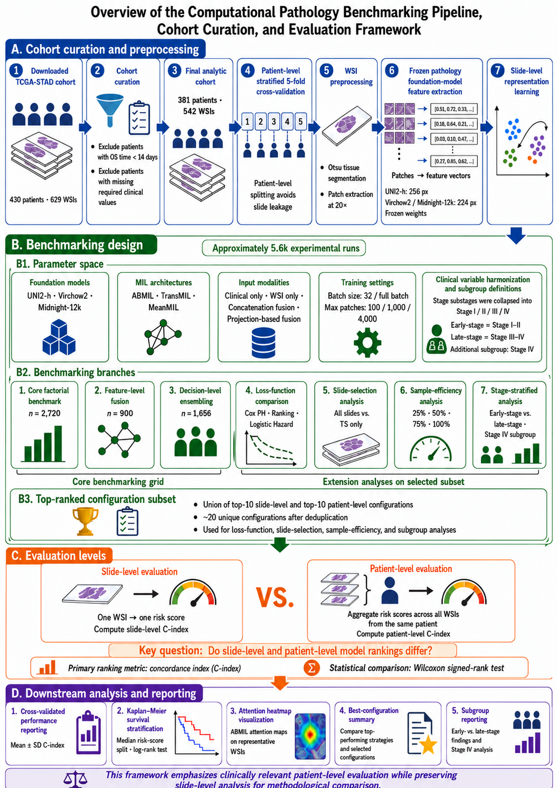
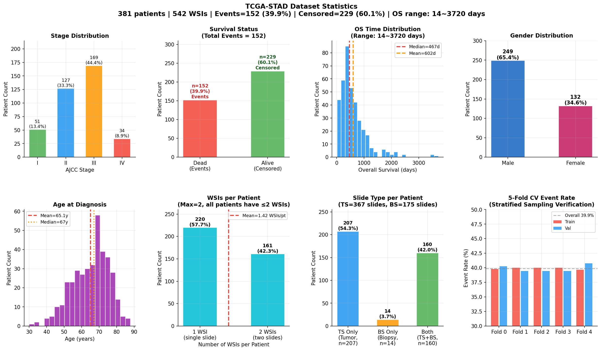
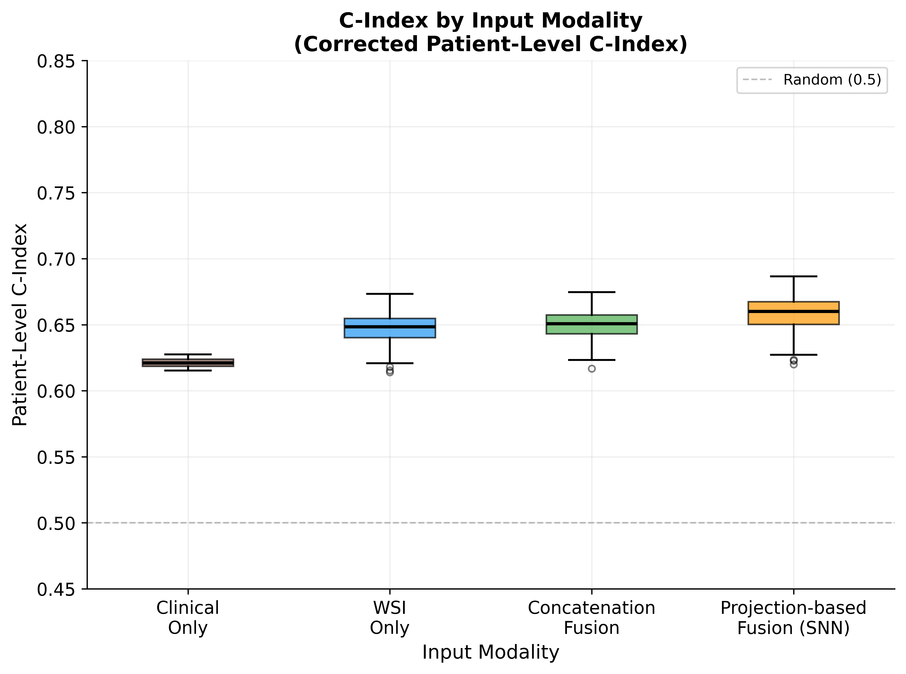
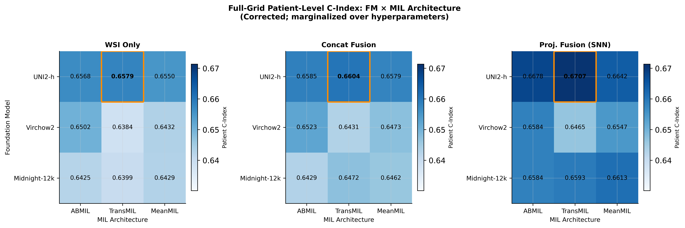
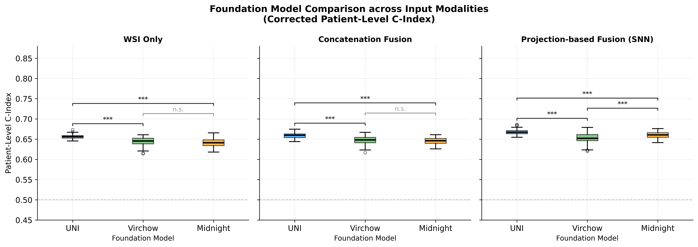
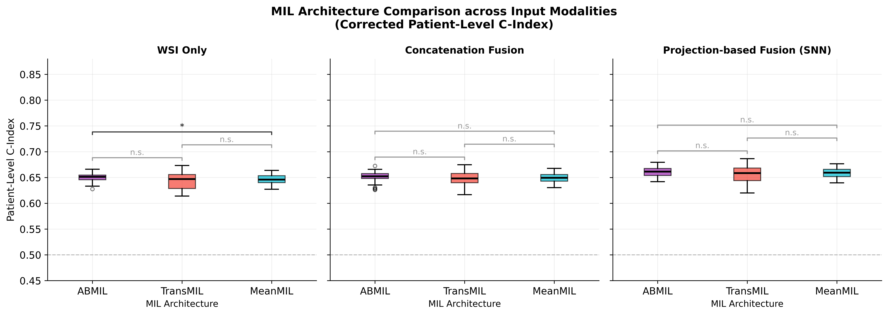
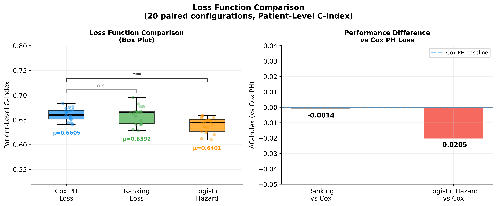
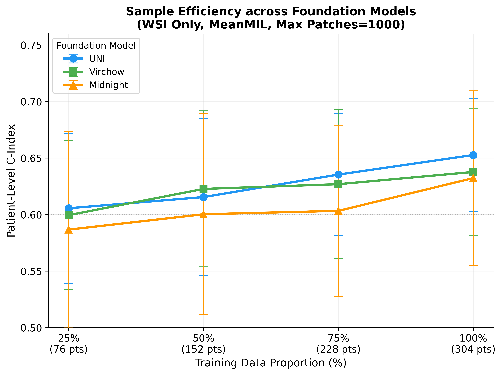
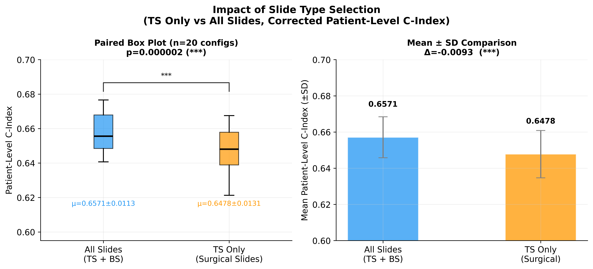
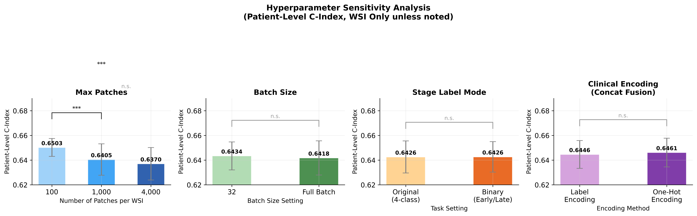

# Systematic Benchmarking of Foundation Models, MIL Architectures, and Multimodal Fusion for Gastric Cancer Survival Prediction on TCGA-STAD

**Tse-Hsiang Wang, Yen-Jung Chiu***  
Institute of Biomedical Engineering, Chang Gung University, Taoyuan, Taiwan  
*Corresponding author

> **Paper:** Submitted to ICBBE 2026 (ACM format, Ei/Scopus indexed)

---

## Overview

We benchmark **3 pathology foundation models × 3 MIL aggregators × 4 input modalities × 3 survival losses** for gastric cancer overall survival prediction on TCGA-STAD — **796 unique configurations, 3,980 training runs** — under a unified patient-level stratified 5-fold cross-validation protocol. A further 1,656 decision-level ensemble combinations are evaluated post-hoc without retraining.

### Key Finding

> **Projection-based Fusion (SNN)** is the only design choice that significantly improves patient-level C-Index over WSI-only (0.660 vs. 0.640, Wilcoxon p=0.004). Foundation model and MIL architecture choices span gaps smaller than fold-level variability and are not separately distinguishable at this dataset scale.

---

## Pipeline



*Figure 1. Benchmarking pipeline: cohort curation, preprocessing, full-factorial grid, extension branches, and patient-level evaluation framework.*

---

## Dataset



*Figure 2. TCGA-STAD cohort statistics: stage and gender distributions, OS time, age, WSIs per patient, slide-type composition, and per-fold event rate.*

| Property | Value |
|---|---|
| Cohort | TCGA-STAD |
| Patients | 381 |
| WSIs | 542 (367 TS + 175 BS) |
| Events (deaths) | 152 (39.9%) |
| Right-censored | 229 |
| Median OS | 467 days |
| Mean age | 65.1 years |
| AJCC Stage I / II / III / IV | 51 / 127 / 169 / 34 |
| Patients with 1 WSI | 220 (57.7%) |
| Patients with 2 WSIs | 161 (42.3%) |
| Cross-validation | Patient-level stratified 5-fold (seed = 42) |

**Slide types:** TCGA-STAD contains only frozen sections — top section (TS) and bottom section (BS) cut from adjacent faces of the same tissue block. No FFPE diagnostic slides (DX barcode) are present.

---

## Foundation Models

| Model | Tile Size | Model Input | Embedding Dim | Token Read-out | Pretraining Data |
|---|---|---|---|---|---|
| **UNI2-h** | 256 px | 224 px | 1536 | CLS | >300,000 H&E/IHC WSIs |
| **Virchow2** | 224 px | 224 px | 2560 | CLS ⊕ mean patch | ~3.1M WSIs (private) |
| **Midnight-12k** | 224 px | 224 px | 1536 | CLS | ~12,000 public TCGA WSIs |

> ⚠️ Midnight-12k was pretrained entirely on TCGA data, overlapping our evaluation cohort — results should be interpreted with caution.  
> ⚠️ Virchow2 uses CLS + mean patch token; UNI2-h and Midnight-12k use CLS only (departing from Midnight-12k's own benchmark protocol).

---

## Experimental Design

The benchmarking protocol comprises a full-factorial core grid and five extension branches.

| Experiment | Unique Configs | Training Runs (5-fold) |
|---|---|---|
| Core full-factorial | 544 | 2,720 |
| Cross-FM feature fusion | 180 | 900 |
| Loss function comparison | 40 | 200 |
| Slide-inclusion ablation | 20 | 100 |
| Sample efficiency | 12 | 60 |
| **Total (trained models)** | **796** | **3,980** |
| Decision-level ensembling (post-hoc, no retraining) | — | 1,656 combinations |

---

## Computational Environment

All experiments were conducted on two dedicated servers. Feature extraction was performed on a high-memory GPU server; downstream MIL training and evaluation were performed on a separate training server.

| Stage | Task | Key Tools | Hardware |
|---|---|---|---|
| **Preprocessing & Feature Extraction** | WSI tiling, tissue segmentation, frozen FM inference | TRIDENT, PyTorch 2.13.0+cu130, timm 1.0.26, transformers 4.44.0, CUDA 13.0 / cuDNN 9.2.0 | NVIDIA RTX 5090 (32 GB), AMD Threadripper PRO 9955WX |
| **MIL Training & Evaluation** | ABMIL / TransMIL / MeanMIL, 5-fold CV, survival analysis | PyTorch 1.12.0, lifelines 0.30.0, scikit-learn 1.6.1, CUDA 11.3 | NVIDIA RTX 3060 (12 GB), Intel i5-13600KF |

---

## Results

### 1. Input Modality and Multimodal Fusion



*Figure 3. Patient-level C-Index across four input modalities (27 configurations; p=1000, bs=32).*

| Input Modality | Mean C-Index | vs. WSI Only |
|---|---|---|
| Clinical Only | 0.6286 | — |
| WSI Only | 0.6405 | (reference) |
| Concatenation Fusion | 0.6446 | p = 0.164 (n.s.) |
| **Projection-based Fusion (SNN)** | **0.6599** | **p = 0.004 ✓; vs. Concat p = 0.008 ✓** |

---

### 2. Foundation Model and MIL Architecture



*Figure 4. Full-grid patient-level C-Index heatmap: FM × MIL, across three input modalities.*

| Foundation Model | Mean C-Index (WSI-only) | Δ vs. UNI2-h |
|---|---|---|
| UNI2-h | 0.6459 | (reference) |
| Virchow2 | 0.6417 | −0.004 |
| Midnight-12k | 0.6338 | −0.012 |

| MIL Architecture | Mean C-Index (WSI-only) | Δ vs. ABMIL |
|---|---|---|
| ABMIL | 0.6431 | (reference) |
| TransMIL | 0.6416 | −0.002 |
| MeanMIL | 0.6366 | −0.006 |

> Contrasts at n = 3 paired configurations are **descriptive only** — Wilcoxon signed-rank test requires minimum n = 6 for p < 0.05 to be attainable. Gaps of 0.006–0.012 are well within 5-fold SDs of 0.03–0.06.



*Supplementary: Foundation model comparison boxplots across three input modalities.*



*Supplementary: MIL architecture comparison boxplots across three input modalities.*

---

### 3. Loss Function Comparison



*Figure 5. Loss function comparison (n = 20 paired configurations).*

| Loss Function | Mean C-Index | vs. Cox PH |
|---|---|---|
| **Ranking Loss** | **0.6527** | **p = 0.008** (Δ = +0.0043) |
| Cox PH | 0.6483 | (reference) |
| Logistic Hazard | 0.6323 | **p = 0.004** (Δ = −0.0160) |

Ranking Loss is statistically superior but practically equivalent (+0.004 C-Index). Logistic Hazard is clearly worse: its discrete-time design estimates more parameters than justified at this sample size.

---

### 4. Sample Efficiency



*Figure 6. Patient-level C-Index across training data fractions (WSI-only, MeanMIL, p = 1000, full batch).*

| Training Proportion | UNI2-h | Virchow2 | Midnight-12k |
|---|---|---|---|
| 25% (76 pts) | 0.6056 ± 0.0664 | 0.5995 ± 0.0659 | 0.5867 ± 0.0870 |
| 50% (152 pts) | 0.6155 ± 0.0697 | 0.6227 ± 0.0690 | 0.6003 ± 0.0889 |
| 75% (228 pts) | 0.6354 ± 0.0541 | 0.6269 ± 0.0658 | 0.6033 ± 0.0758 |
| 100% (304 pts) | 0.6527 ± 0.0502 | 0.6377 ± 0.0565 | 0.6323 ± 0.0771 |

---

### 5. Slide Type Selection



*Figure 7. TS-only vs. all-slides comparison (n = 20 paired configurations).*

| Strategy | Mean C-Index | p-value |
|---|---|---|
| All slides (TS + BS) | 0.6493 | (reference) |
| TS Only | 0.6478 | p = 0.452 (n.s., Δ = +0.0015) |

---

### 6. Hyperparameter Sensitivity



*Figure 8. Sensitivity analysis across max patches, batch size, stage label mode, and clinical encoding method. All contrasts are non-significant.*

---

### 7. Kaplan-Meier Survival Analysis


*Figure 9. KM curves for best configuration per category (median risk-score stratification, 5-fold pooled predictions).*

| Category | Best Configuration | C-Index | Log-rank p |
|---|---|---|---|
| **UNI2-h** | Proj. Fusion + TransMIL, p=1000/bsFull/one_hot | **0.6866 ± 0.0235** | **p < 0.001 \*\*\*** |
| Virchow2 | Proj. Fusion + TransMIL, p=100/bs32/binary/one_hot | 0.6791 ± 0.0486 | p = 0.005 \*\* |
| Midnight-12k | Proj. Fusion + MeanMIL, p=100/bs32/binary/label_enc | 0.6761 ± 0.0745 | p = 0.001 \*\* |
| WSI Only | TransMIL + UNI2-h, p=1000/bsFull | 0.6733 ± 0.0300 | p = 0.008 \*\* |
| Clinical Only | SNN, bsFull/original/label_enc | 0.6275 ± 0.0532 | p = 0.213 n.s. |

---

### 8. Attention Heatmaps


*Figure 10. Attention heatmap of the best configuration overlaid on the WSI.*


*Figure 11. Attention heatmap comparison across three foundation models on the same WSI.*

---

### 9. Top-10 Best Configurations (all 796)

| Rank | Configuration | Patient C-Index |
|---|---|---|
| 1 | Ranking Loss + Proj. Fusion + TransMIL + UNI2-h + p4000/bs32 | **0.6955 ± 0.0359** |
| 2 | Proj. Fusion + TransMIL + UNI2-h + p1000/bsFull + one_hot | 0.6866 ± 0.0235 |
| 3 | Proj. Fusion + TransMIL + UNI2-h + p4000/bs32 + binary/one_hot | 0.6848 ± 0.0315 |
| 4 | Proj. Fusion + TransMIL + UNI2-h + p4000/bsFull | 0.6834 ± 0.0384 |
| 5 | Ranking Loss + Proj. Fusion + TransMIL + UNI2-h + p4000/bsFull | 0.6822 ± 0.0278 |
| 6 | Proj. Fusion + ABMIL + UNI2-h + p100/bsFull | 0.6796 ± 0.0295 |
| 7 | Proj. Fusion + TransMIL + Virchow2 + p100/bs32 | 0.6791 ± 0.0486 |
| 8 | Proj. Fusion + TransMIL + UNI2-h + p4000/bs32 | 0.6782 ± 0.0372 |
| 9 | Proj. Fusion + ABMIL + UNI2-h + p100/bs32 | 0.6779 ± 0.0428 |
| 10 | Ranking Loss + Proj. Fusion + ABMIL + UNI2-h + p100/bs32 | 0.6769 ± 0.0312 |

**All Top-10 use Projection-based Fusion (SNN). 9/10 use UNI2-h.**

---

### 10. Summary: All Design Dimensions

| Dimension | Level | C-Index | Paired Comparison |
|---|---|---|---|
| Input modality (n=27) | Clinical Only | 0.6286 | — |
| | WSI Only | 0.6405 | (reference) |
| | Concatenation Fusion | 0.6446 | p = 0.164 (n.s.) |
| | **Projection-based Fusion** | **0.6599** | **vs. WSI p = 0.004; vs. Concat p = 0.008** |
| Foundation model (n=3, descriptive) | UNI2-h | 0.6459 | (reference) |
| | Virchow2 | 0.6417 | Δ = −0.004 |
| | Midnight-12k | 0.6338 | Δ = −0.012 |
| MIL architecture (n=3, descriptive) | ABMIL | 0.6431 | (reference) |
| | TransMIL | 0.6416 | Δ = −0.002 |
| | MeanMIL | 0.6366 | Δ = −0.006 |
| Loss function (n=20) | Ranking Loss | 0.6527 | p = 0.008 |
| | Cox PH | 0.6483 | (reference) |
| | Logistic Hazard | 0.6323 | p = 0.004 |
| Slide inclusion (n=20) | All slides (TS+BS) | 0.6493 | (reference) |
| | TS Only | 0.6478 | p = 0.452 (n.s.) |

---

## Repository Structure
---

## Important Note: C-Index Correction

An early implementation computed patient-level C-Index using DataFrame row index instead of actual OS time, inflating values by approximately 0.05 and distorting rankings. **All values in this repository are corrected.** Model training, predictions, and Kaplan-Meier curves are unaffected; only post-hoc metric computation was impacted.

---

## Citation

```bibtex
@inproceedings{wang2026stad,
  title     = {Systematic Benchmarking of Foundation Models, MIL Architectures,
               and Multimodal Fusion for Gastric Cancer Survival Prediction on TCGA-STAD},
  author    = {Wang, Tse-Hsiang and Chiu, Yen-Jung},
  booktitle = {Proceedings of ICBBE 2026},
  publisher = {ACM},
  year      = {2026}
}
```

## Funding

National Science and Technology Council, Taiwan (NSTC 113-2221-E-182-066-MY3)
